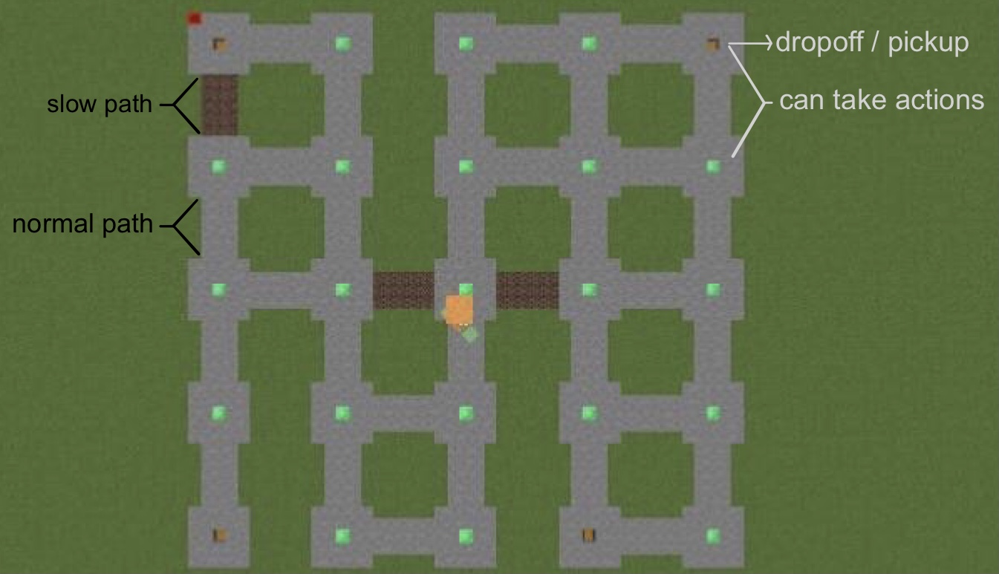

  

## Project Summary
MineExpress is an Artificial Intelligence project developed for routing or delivery tasks, like amazon shipping, Uber, or UberEat. Our goal is to train our agent to pick up and drop off packages or food to the right places. At the same time, we aim to find an optimal path to navigate our agent to those places. To achieve this, we utilized three methods: q-learning algorithm, Dijkstra's algorithm, and random action. Q-learning is our main algorithm. It utilized an agent-environment loop shown below. Within each process, the agent chooses an action, and the environment returns an observation and rewards. We will visualize this process of learning in the game Minecraft and Malmo platform.

  

This project took inspiration from taxi-v3 from Gym (OpenAI) by stimulating the same game settings where our agent has pickup and drop-off actions and finds the optimal path.

**Environment Settings:**

  

Figure above shows our training environment. The arena is 45 * 45 with 25 possible locations where our agent can make an action. These state either has a green block or chest (brown block) in the center. It also have 4 possible locations that are valid for pickup or drop-off. These locations has a chest in the center. At the beginning of each mission, one of the four states that have a chest will be assigned as the package location for pickup, and one of the remaining three states will be assigned as the destination for drop-off. Our agent should only pick the package up at the package location and drop it off at the destination.
There are two types of the path. It simulates the real-world environment with different moving speeds for routes. The stone blocks are the path with normal speed. The soul sand block, however, slows down the speed of our agent.

Our agent will start randomly at the top of a state. It is not allowed to walk into the grass block. It can only move a step at a time, pick up the package, or drop off the package.

Block Types summary:

    - Normal state: Emerald Block 
    - Pickup / Drop-off state: Chest
    - Common Speed: Stone
    - Speed Down: Soul Sand
    
**Motivation:**

During the period of the covid virus, many people stayed at home to ensure their safety. At this time, food and express delivery often face the problem of insufficient manpower. An AI that can adapt to any environment and perform such work can greatly facilitate people's lives. We hope to develop such AI. It should not pick up or drop off the package at the wrong place. It should also choose the right path that minimizes the total delivery time. Using AI/ML algorithms is essential because it allows our agent to learn from the environment. Our agent can thus adapt to any new environment. In many real situations, the environment will not be known to the agent, for example, a pizza delivery AI wants to deliver the food to a new neighborhood. AI/ML algorithms allow the AI to learn human intervention.

## Approaches
We will introduce how the random action, Dijkstra's algorithm, and the q-learning algorithm are used in this project below.

**Setting For All Approches**

Actions:

We use discrete movement commands to train our agents because using continuous movement will make it harder to determine the q-value for an individual state. There are 6 possible actions in a state:

    0: move north
    1: move south
    2: move east
    3: move west
    4: picup
    5: drop-off

Rewards:

    - Pass the soul sand path (that slows down the agent’s speed): -4
    - Pass the stone path (with normal speed): -1
    - Pick up the package in the wrong location: -10
    - Drop off the package in the wrong location: -10
    - Drop off the package in the right location: +20
    
Malmo XML does not support any of the above reward settings. Because the dropoff location is only valid to drop-off when the package has picked up, and because the pickup location will no longer be valid to pick up after the package has picked up, the validity of these blocks changes when a mission is running. The built-in reward element <RewardForTouchingBlockType> does not support it. It neither can give the right rewards to different blocks our agent passed because <RewardForTouchingBlockType> only rewards for blocks the agent currently stands on, while it does not know about the previous block type. 
	
We self-defined all the rewards. We store the previous block type, look it up when summing rewards, and update it in each iteration to reward for passing different types of blocks. To determine the validity of each block to pick up and drop off, we store the pickup and dropoff location as a class variable. When the action pickup is executed, we check if the package has not been picked up and the pickup location matches the current agent location. if the condition fails, we reward negatively. Similarly, when the action drop-off is executed, we check if the package is carried by the agent and two locations match.

**Random Action**

We use random actions to be the baseline of the q-learning algorithm. It simply chooses one of the 6 actions each state.

**Dijkstra’s Algorithm**

We use Dijkstra's algorithm as the upper bound for the q-learning algorithm because Dijkstra’s algorithm can always find the overall optimal path with enough information about the environment. We use the same discrete movement commands and action list as the q-learning algorithm for comparison.

To find the optimal a path from a start point to destination, we use Dijkstra's algorithm in following steps:

    (1. Initialize two priority dictionaries and save the start point)
    grid_dist: key = block index; value = the cost from the start to the key
    pre_dist: key = block index; value = neighbor block index that constitutes the current optimal path from start to the key.
    grid_dist[source] = 0
    pre_dist[source] = -1

    (2. Add path to pre_dist)
    While grid_dist is not empty:
	Choose a key k with the smallest value from grid_dist and search all its neighbor blocks. 
	If any of the k’s neighbor blocks is valid:
		Determines the cost from start to the block (start to k + k to block).
		If the block index in not in grid_dist or cost < old value, updates grid_dist[block_index] = cost. Updates pre_dist[block_index] = k.  
	        Delete k from grid_dist
		    
    (3. Extract the path from pre_dist)
    curr = destination
    while pre_dist[curr] != -1:
    	Adds curr to the beginning of optimal_path_list
	curr = pre_grids[curr]
    Adds the start point to the beginning of optimal_path_list

  

For example, we want to find an optimal path from block 1 to block 4 showing above, grid_dist and pre_dist will undergo the following changes:

    Before Iteration: 
    	grid_dist[ 1:0 ]
	pre_dist[ 1:-1 ]
    Iteration 1:
	grid_dist[ 2:1, 4:4 ]
	pre_dist[ 1:-1, 2:1, 4:1 ]
    Iteration 2:
	grid_dist[ 3:2, 4:4 ]
	pre_dist[ 1:-1, 2:1, 4:1, 3:2 ]
    Iteration 3:
	grid_dist[ 4:3 ]
	pre_dist[ 1:-1, 2:1, 4:3, 3:2 ]
	
The pre_dist provides us the optimal_path_list = [1, 2, 3, 4]. 

Once we get the path_list, we can navigate our agent to finish the mission.

For rewards, we go through the optimal_path_list. If the block is stone, we minus 1 to the reward; if the block is soul sand, we minus 4 to the reward. The reward is added to 20 when the mission ends.

**Q-Learning Algorithm**

We use q-learning as our main algorithm to train the agent to find the optimal path both from the starting location to the pickup location and from the pickup location to the drop-off position. Given an agent state and an action, the algorithm stores the corresponding q-values in a table and updates the table each time after an action is executed. 

Q-table: 

Our q-table has 500 states (5 * 5 * 5 * 4). The first “5” and the second “5” are possible x-axis locations and z-axis locations. The third “5” is a possible package location. While our map has 4 chests and 4 possible pickup locations the package is initially in. It is also possible that the package is already in our agent’s inventory slot. Thus there are 5 possible package locations. The final “4” is the possible drop-off location. Besides, the package location is 0-3 if it is inside one of the boxes and 4 if it is carried by our agent. 

We store the q-table in a dictionary. Each state is a key, and the q-values of actions is the corresponding value. With 500 states and 6 possible actions in each state, our q-table stores a total of 3000 q-values.

Update Q-Value:

Our q-table is initially empty. After an action is executed, We store the previous state into the q-table and update the q-value for the action. The q-value is determined by the equation below:

  

    α: learning rate (range from 0 to 1)
    γ:  discount rate for future rewards (range from 0 to 1). 
    
Good choices of α and γ are important to the performance of our agent. For example, setting α to 0.1 and γ to 1 makes the agent stick to a feasible but non-optimal path. We finally set α to 0.1 and 0.6 after some tests.

    Q(s, a) : previous state and action; 
    maxQ’(s’, a’): q-value for the best action in the agent's current state
    R(s,a): reward after executing the previous action. 
    
For example, if our agent is initialized in the location (0, 0). The package location indexed is 1, and the dropoff location index is 2. An action, such as move south, updates the state of (0, 0, 1, 2) and its action space 1. In this case, s is (0, 0, 1, 2); a is 1; s’ is (0,1); a’ can be any action because they are all 0 at the beginning of the training.

Next Actions:

A new action is chosen by ε-greedy exploration below.

  

It allows our agent to choose the current best action with a high probability. While sometimes the agent can also choose other actions that may lead to higher reward. We set ε to 0.1.

Summing up:

the whole process of training out agent by q-learning is shown below:

  

**Comparison between Dijkstra's algorithm and q-learning:**

Dijkstra's algorithm is easy to implement and can find the optimal solution much faster than q-learning. For our problem, Training our agent with q-learning can take up to a day in the Malmo platform, however, Dijkstra's algorithm only runs for a few seconds for each mission. If our agent knows how the surrounding environment looks, Dijkstra's algorithm is more useful than q-learning.  

However, for many real-world tasks, the agent is placed in an unfamiliar environment, Dijkstra's algorithm will not work because it first finds the shortest path using the environment information and sends commands to act afterward. For example, in our problem, we set <ObservationFromGrid> parameters to the value that all valid blocks' information is available (min x/z = -twice of the map, max x/z = twice of the map). Comparatively, q-learning can work with block information right below the agent. Thus compared to Dijkstra's algorithm that has limited usage, q-learning can be used in a variety of problems. 
  

## Evaluation

## References
- Parameter of q-learning formula https://stackoverflow.com/questions/1854659/alpha-and-gamma-parameters-in-qlearning
- Ε-greedy exploration (figure) https://www.geeksforgeeks.org/epsilon-greedy-algorithm-in-reinforcement-learning/
- Q-Learning Algorithm Library https://pypi.org/project/pyqlearning/
- Assignments from CS 175
- tabular_q_learning.py from malmo example
- XML Schema Documentation https://microsoft.github.io/malmo/0.30.0/Schemas/Mission.html
- Taxi-v2 from Gym (https://gym.openai.com/envs/Taxi-v2/)
