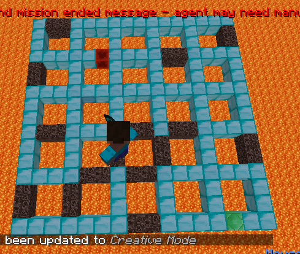
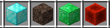
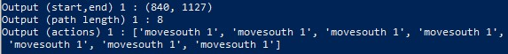
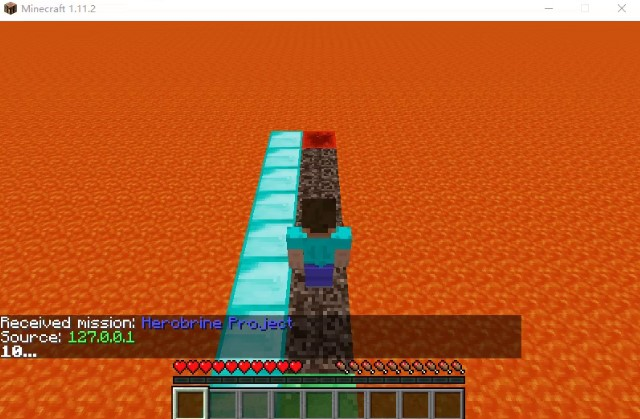

## Project summary
Our project aims to find a path that minimizes the time travel to a randomized destination. Our training environment is a 16 * 16 grid map. Each grid is a 4 * 4 hollow squares, whose edges consist of soul sand or diamond block, to give agents different speed properties in the different paths. We train our agent by machine learning algorithm to reach our goal.

Block Type:
- Start Point: Redstone Block
- End Point: Emerald Block
- Common Speed: Diamond Block
- Speed Down: Soul Sand

## Approach
We use the q-learning algorithm and ε-greedy method to train our agent. Our q-table has a state number that corresponds to the non-air block number. We have 4 actions that include up, down, left, and right. 
For each iteration, we update our q value according to the algorithm:

For now, we just give a high reward when our agent reaches the destination. We will adjust it in the future. The function also gives negative rewards when the agent falls to the lava and when time passes. To achieve this, we use <RewardForTouchingBlockType> and <RewardForTimeTaken> in our mission XML file.

## Evaluation
Quantitative:
We have implemented the baseline agent. The baseline’s only metric is distance regardless of the block type and time cost. It picks a random path if more than one path is the shortest one. We used the Dijkstra algorithm from assignment 1. It ensures that the agent is traveling within the minimum amount of distance. The image below shows the output for our baseline. 

Qualitative:
The sanity check below shows a case that our baseline fails. It goes straight from the start point (in green) to the destination (in red) because it does not consider the running time. Our final agent should choose the left-hand side path instead because diamond blocks on the left give it a higher speed, thus it can reach the destination quicker.

## Remaining Goals and Challenges
1. The algorithm costs a long time to train, we aim to find the balance between the running time and the performance.
2. We hope to improve our reward function in response to different moving speeds of blocks.
3. We will test more QL input parameters such as the learning rate to improve performance.
4. We will modify the output to have a better comparison between baseline and final performance.

## Resources Used
- Q-learning library  https://pypi.org/project/pyqlearning/
- Q learning tutorial https://www.youtube.com/watch?v=aCEvtRtNO-M
- Assignment 1 from CS 175
- tabular_q_learning from malmo example
- XML Schema Documentation https://microsoft.github.io/malmo/0.30.0/Schemas/Mission.html

